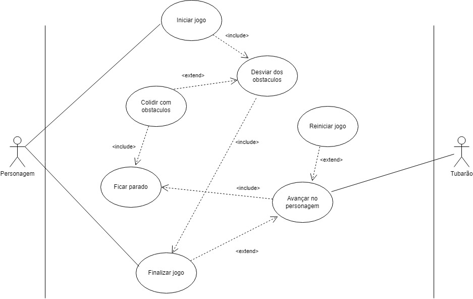

# Diagramas-DJW
Diagramas do jogo de DJW feito por Cauã Silva e Juliana

## Explicação jogo
O jogador(personagem) deve completar o jogo desviando de obstáculos que vão surgindo na tela. Se ele colidir com algum obstáculo, ele irá ficar parado e o tubarão chegará cada vez mais próximo, se  o tubarão chegar no personagem, fim de jogo.

## Documentação do caso de uso

## Casos de uso

## Diagrama de classes
